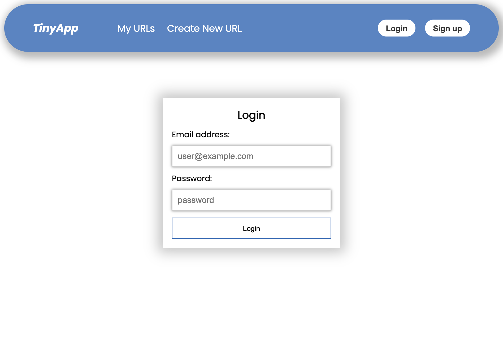
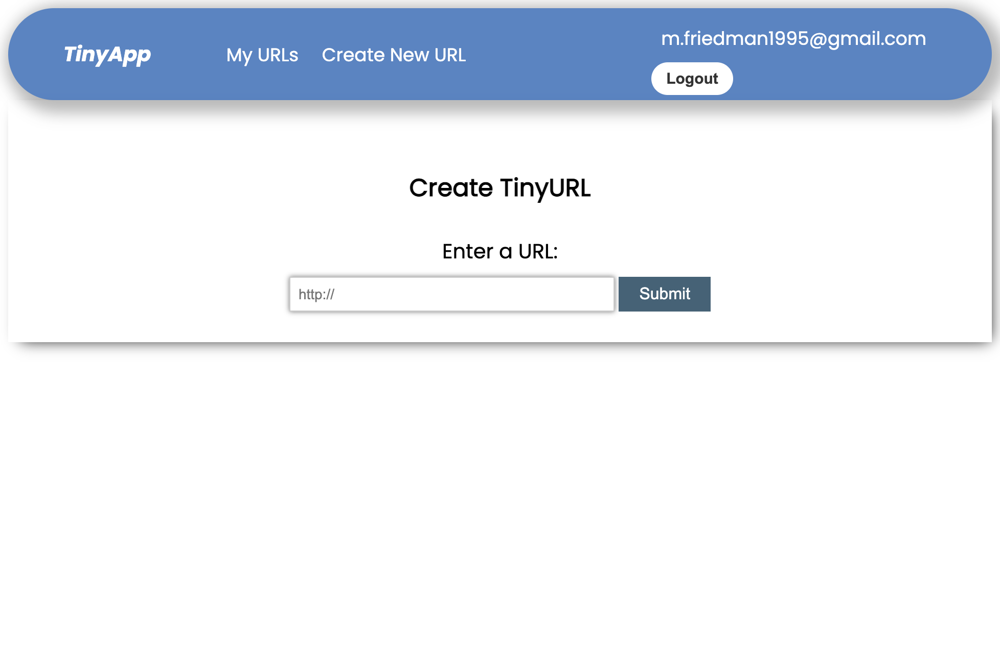
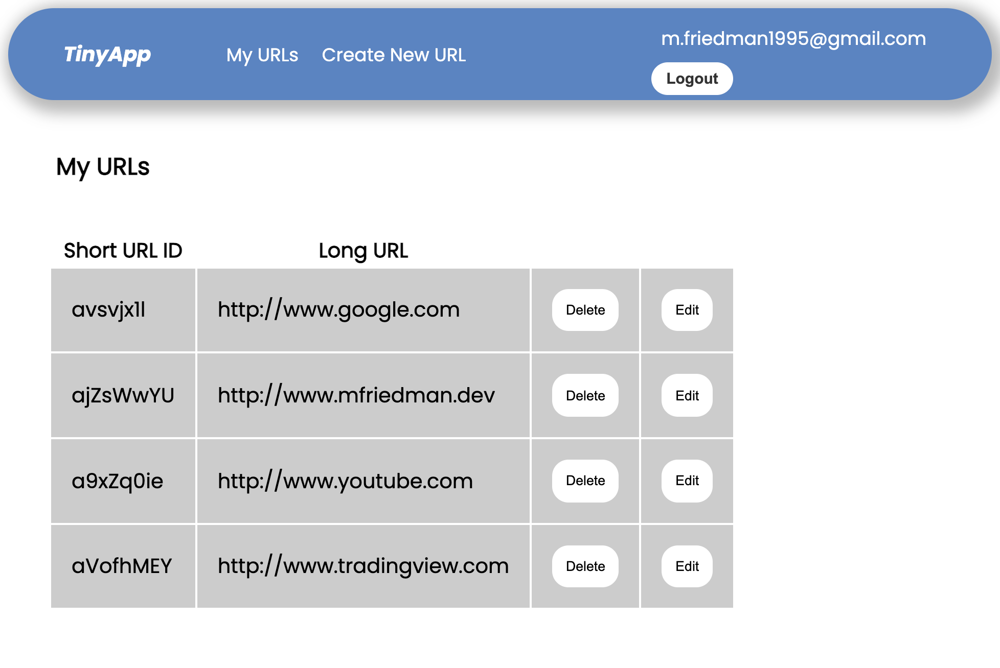

# TinyApp Project

TinyApp is a web application developed using Node.js and Express that allows users to shorten long URLs, much like bit.ly. It is a full-stack application that offers an intuitive interface to efficiently condense URLs.

## Final Product

## Dependencies

- Node.js
- Express
- EJS
- bcryptjs
- cookie-session

## Getting Started
1. Install all dependencies using npm install command.
2. Run the application using npm start.
3. Test the application's files using npm test.
4. To use the application, you must register using your email address.

# What I learned
- How to create an HTTP server that handles requests from the browser
- Creating and verifying user accounts
- Implementing authentication protection
- Password encryption
- Utilizing advanced JavaScript and Node.js concepts
- Implementing HTTP security measures
- Testing with Moca and Chai

# Author
Michael Friedman
[Portfolio](https://mfriedman.dev/)
[Linkden](https://www.linkedin.com/in/michael-friedman-800407242/)
[Email](michael@mfriedman.dev)